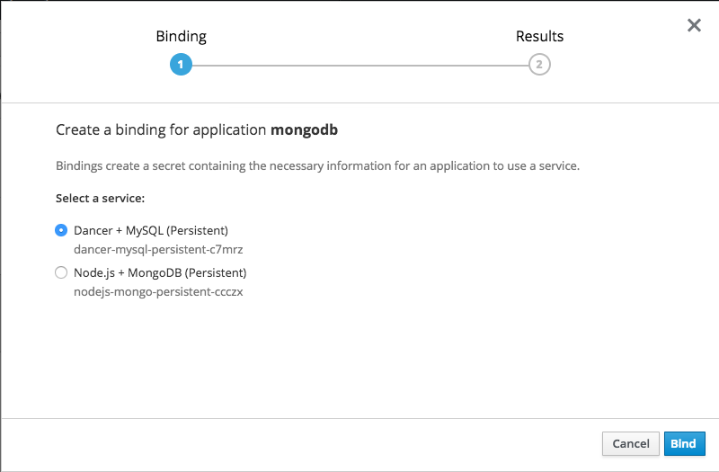
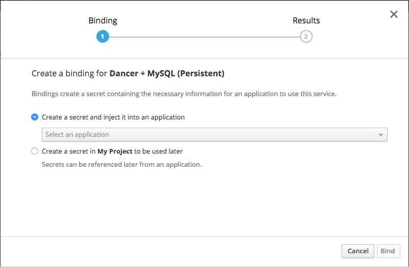
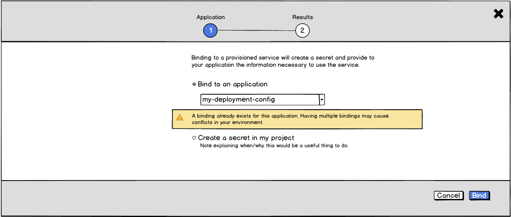
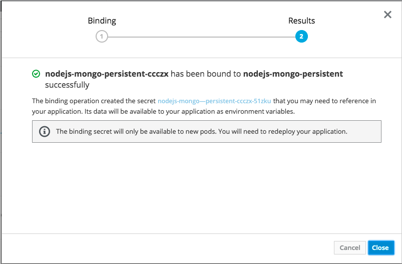
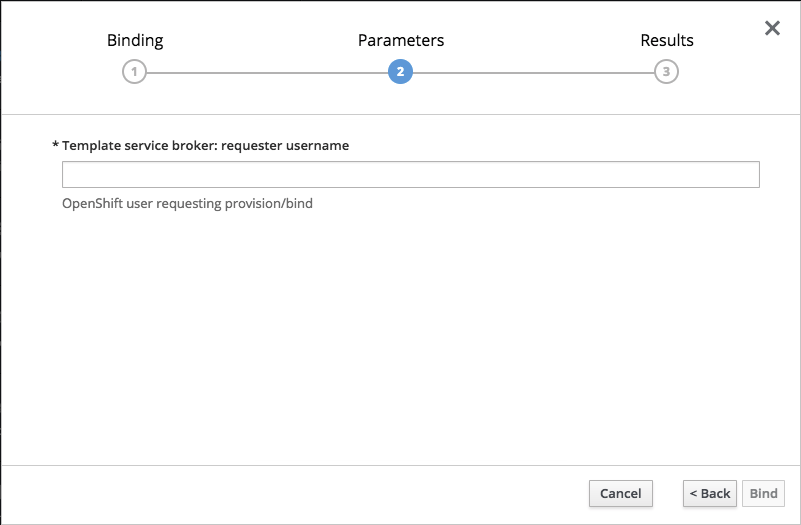
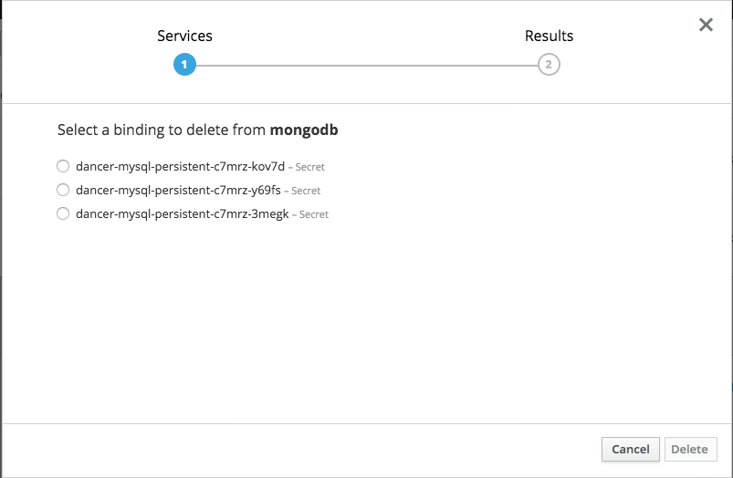
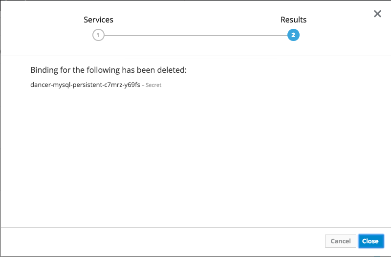
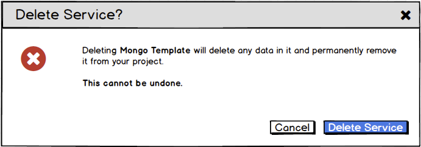
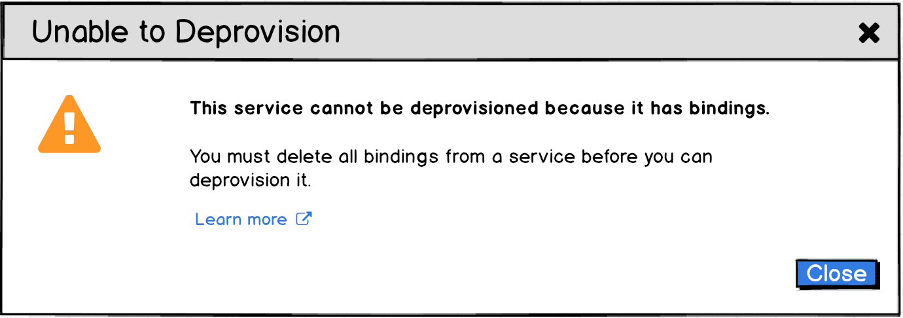

# Binding in Context

- Users may bind Provisioned Services to other applications in their project and vice versa.
- The binding flow will use the [Overlay Panel Pattern](../patterns/overlay-panel.md) and employ a similar wizard experience to the [ordering experience](../patterns/order-from-catalog.md).

## Initiating the bind flow

- A user can initiate a binding from the kebab menus of provisioned services, or from other resources in the overview that can be bound to (anything with pods).
- For provisioned services that do not have any bindings, there is a "Create binding" action in the collapsed state.
- The "+ Create binding" action is always available for Provisioned Services in the expanded state.
- A binding can also be initiated from a deployment config (or similar) in the expanded view IF that deployment is already bound to another service. The “Service Bindings” section does not appear in the overview if there are no bindings.
- **Note:** Once a binding has been created it will show up on the overview and details pages for Deployments, Pods, Provisioned Services, etc. [View Binding Details](./binding-details.md) for info on how Bindings should be displayed.

## Bind flow

### General
- The wizard may be two or three steps depending on whether the service takes binding parameters or not.
- If there are no parameters, the steps are "Binding" and "Results".
- For bindings that take parameters, and additional "Parameters" step is added as step two.

### Binding Step
#### Binding an Application to a Service

- The initial step should include some text to describe to the user what it means to create a binding.
- Available resources should be listed with radio buttons. The first resource should be selected by a default.
- The primary action is "Bind" and "Cancel" should be available as a secondary action.

##### Implementation Details
- Services are listed using the service class display name, with the service instance name in lighter text underneath.
- If a provisioned service is not yet available, a warning triangle with the text "service not ready" should appear inline with the service name.

#### Binding a Service to an Application

- User may select from two different binding options:
	1. Bind to an application
	2. Create a secret in my project
- Binding options are selected via radio buttons. "Bind to an application" is selected by default.
- User may select the application to bind to using a ui-select control. Search should be enabled if there are more than 10 choices in the dropdown.

##### Implementation Details
- The "Bind" button should be disabled until a valid selection has been made--either choosing an application, or selecting the "Create a secret..." radio button.
- Users should get a warning if they try to bind to an application that is already bound to the same service.

### Results Step

- The success message should name both the application and the provisioned service that were bound.
- The success message for the "Create a secret in my project" option should say "Binding created successfully"
- There is a note indicating that binding operation created a secret with a link to the secret.
- Include an action to "View configuration" which would take the user to the page for that secret.
- There should be a note alerting users that changes will not take effect until they redeploy their pods.
- The only action is "Close."

#### Implementation Details
- Following the "View configuration" link would dismiss the overlay panel.

### Parameters Step

- When binding from a service that takes bind parameters to an application, the wizard will display three steps: Binding, Parameters, Results.
- When binding from an application, if the service selected in the Binding step takes parameters, an additional "Parameters" step is dynamically added to the wizard.
- Parameters are shown similarly to the Configuration step of the [Ordering Experience](../patterns/order-from-catalog.md)
- The primary action action for step 1 is "Next" and the primary action for step two is "Bind".
- If the parameters are required, the "Bind" button is disabled until the required fields have been filled.
- A secondary action "Back" is added but is only active on step 2.

## Delete Binding
- Delete Binding would work similarly to binding, following the same two-step process:
	1. Choose the thing to unbind from
	2. Confirmation

- Available resources should be listed with radio buttons. The first resource should be selected by a default.
- The primary action is "Unbind" and "Cancel" should be available as a secondary action.

- The success message should name both the application and the provisioned service that were bound.
- There should be a note alerting users that changes will not take effect until they redeploy their pods.
- The only action button is "Close."

## Delete Service
- The "Delete" action is available in the kebab regardless whether or not a service has any bindings.
- Clicking the "Delete" action brings up a dialog with a strong warning.

- If a service has bindings, alert user that s/he will have to delete bindings before deprovisioning.

#### Community Feedback (if applicable)
- Community Feedback Received
	- Overview of customer feedback received
- Necessary Community Feedback
	- Questions to follow up with community
